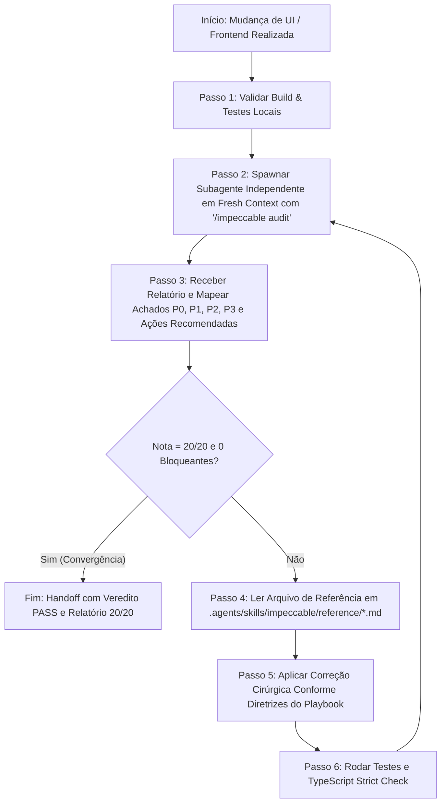

# Impeccable Autonomous Audit Loop (`impeccable-audit-loop`)

> **Propósito:** Eliminar viés de confirmação e refinamento superficial através de um ciclo fechado de auditoria adversarial independente, leitura estrita de playbooks de referência e correções iterativas até a obtenção de nota máxima (**20.0 / 20.0 — Grade A+**) emitida por um agente em *fresh context*.

---

## 🔄 Diagrama do Ciclo Autônomo



---

## 📜 Princípios Fundamentais do Loop

1. **Proibição de Auto-Avaliação Viesada:**
   - O agente orquestrador **NUNCA** deve declarar sua própria nota como 20/20. A pontuação só é válida quando emitida por um subagente independente invocado via `invoke_subagent` com o prompt PURO `"/impeccable audit"`.
2. **Leitura Mandatória de Playbooks (`reference/*.md`):**
   - Ao receber uma ação recomendada da auditoria (ex: `/impeccable harden`), é **MANDATÓRIO** abrir e ler o arquivo `.agents/skills/impeccable/reference/harden.md` antes de aplicar qualquer linha de código.
3. **Execução Cirúrgica Sem Regressões:**
   - Tocar apenas nos elementos sinalizados no diagnóstico.
   - Cada ciclo de correção deve rodar `npx tsc --noEmit` e a suíte de testes unitários para garantir integridade.
4. **Critério de Parada Não-Negociável:**
   - **Audit Health Score:** **20.0 / 20.0** (4/4 em A11y, 4/4 em Performance, 4/4 em Theming, 4/4 em Responsive, 4/4 em Integrity).
   - **Bloqueantes:** 0 P0 e 0 P1.
   - **Veredito:** `PASS (Aprovado com Excelência)`.

---

## 🗂️ Mapeamento de Ações Recomendadas & Arquivos de Referência

Sempre que o relatório de auditoria recomendar uma ação específica, consulte e aplique as regras do arquivo correspondente localizado em `.agents/skills/impeccable/reference/`:

| Ação Recomendada | Arquivo de Playbook Obrigatório | Foco Principal / Quando Aplicar |
|---|---|---|
| `/impeccable audit` | [`reference/audit.md`](file:///c:/Users/Gustavo/Desktop/IAFinanceInvest/.agents/skills/impeccable/reference/audit.md) | Protocolo de auditoria técnica das 5 dimensões (A11y, Perf, Resp, Theme, Integrity). |
| `/impeccable harden` | [`reference/harden.md`](file:///c:/Users/Gustavo/Desktop/IAFinanceInvest/.agents/skills/impeccable/reference/harden.md) | Correção de erros de tipagem estrita (TypeScript), tratamento de erros, sanitização de inputs, boundary checks e i18n. |
| `/impeccable polish` | [`reference/polish.md`](file:///c:/Users/Gustavo/Desktop/IAFinanceInvest/.agents/skills/impeccable/reference/polish.md) | Ajustes finais de alinhamento, espaçamento, micro-contrastes, focus rings, hover states e tokens semânticos. |
| `/impeccable clarify` | [`reference/clarify.md`](file:///c:/Users/Gustavo/Desktop/IAFinanceInvest/.agents/skills/impeccable/reference/clarify.md) | Acessibilidade semântica de formulários, labels explícitos (`htmlFor`), atributos WAI-ARIA (`aria-label`, `aria-busy`, `aria-live`). |
| `/impeccable colorize` | [`reference/colorize.md`](file:///c:/Users/Gustavo/Desktop/IAFinanceInvest/.agents/skills/impeccable/reference/colorize.md) | Calibração de contraste de cores (WCAG AA/AAA $\ge 4.5:1$), eliminação de violações de paleta (*Purple Ban*) e cores dinâmicas para modo claro/escuro. |
| `/impeccable adapt` | [`reference/adapt.md`](file:///c:/Users/Gustavo/Desktop/IAFinanceInvest/.agents/skills/impeccable/reference/adapt.md) | Responsividade, reflow para telas ultracompactas (<360px), isolamento de scroll em tabelas e touch targets mínimos de $44 \times 44\text{px}$ (WCAG 2.5.5). |
| `/impeccable distill` | [`reference/distill.md`](file:///c:/Users/Gustavo/Desktop/IAFinanceInvest/.agents/skills/impeccable/reference/distill.md) | Remoção de classes arbitrárias hardcoded (`#hex`), substituição por tokens semânticos do Design System e simplificação de layout. |
| `/impeccable optimize` | [`reference/optimize.md`](file:///c:/Users/Gustavo/Desktop/IAFinanceInvest/.agents/skills/impeccable/reference/optimize.md) | Otimização de performance: eliminação de Cumulative Layout Shift (CLS com `minHeight`), memoização (`React.memo`/`useMemo`), debounce de I/O e code-splitting. |
| `/impeccable animate` | [`reference/animate.md`](file:///c:/Users/Gustavo/Desktop/IAFinanceInvest/.agents/skills/impeccable/reference/animate.md) | Microinterações intencionais, transições táteis e conformidade com `prefers-reduced-motion` (WCAG 2.3.3). |
| `/impeccable typeset` | [`reference/typeset.md`](file:///c:/Users/Gustavo/Desktop/IAFinanceInvest/.agents/skills/impeccable/reference/typeset.md) | Hierarquia tipográfica, fontes monoespaçadas com números tabulares (`tnum 1, zero 1`) e registro de escalas no `DESIGN.md`. |
| `/impeccable layout` | [`reference/layout.md`](file:///c:/Users/Gustavo/Desktop/IAFinanceInvest/.agents/skills/impeccable/reference/layout.md) | Estrutura de grid, padding, remoção de opacidade reduzida inicial em ícones e alinhamento visual de alta densidade. |
| `Craft Floor Rules` | [`reference/craft-floor.md`](file:///c:/Users/Gustavo/Desktop/IAFinanceInvest/.agents/skills/impeccable/reference/craft-floor.md) | Piso mínimo de qualidade não-negociável, proibições estritas e reflexos de design. |

---

## 🛠️ Passo a Passo de Execução do Protocolo

### 1. Invocação do Auditor Independente (Fresh Context)
Dispare o subagente isolado através da ferramenta `invoke_subagent`:
```json
{
  "Subagents": [
    {
      "TypeName": "research",
      "Role": "Impeccable Independent Auditor",
      "Prompt": "/impeccable audit",
      "Workspace": "inherit"
    }
  ]
}
```

### 2. Análise do Relatório Retornado
Ao receber a notificação de término do subagente, extraia:
- **Audit Health Score:** Exemplo: `18/20` ou `19/20`.
- **Lista de Achados:** Severidades P0, P1, P2 e P3 com arquivos e linhas afetadas.
- **Ações Recomendadas:** Lista de comandos Impeccable indicados pelo auditor.

### 3. Leitura do Playbook de Referência
Para cada ação recomendada, execute `view_file` no playbook correspondente antes de codificar.  
*Exemplo:* se o achado for sobre tipagem implícita e a recomendação for `/impeccable harden`:
1. Chame `view_file` em `.agents/skills/impeccable/reference/harden.md`.
2. Identifique os padrões e regras estabelecidos no playbook.

### 4. Aplicação Cirúrgica das Alterações
1. Use `replace_file_content` para corrigir exclusivamente as linhas identificadas.
2. Não altere código não relacionado nem introduza dependências desnecessárias.

### 5. Verificação Estrita Local
Execute o comando de verificação no terminal:
```powershell
npx tsc --noEmit; npm run build; npm test
```
Garantir que o código de saída seja `0` e que todos os testes passem.

### 6. Repetição do Loop
Se a pontuação for `< 20/20` ou houver qualquer apontamento P0/P1/P2/P3 pendente, volte imediatamente ao **Passo 1** e reinvoque o auditor independente em fresh context.

---

## 🎯 Critério de Sucesso & Conclusão
O loop se encerra automaticamente apenas quando o auditor independente em fresh context emitir:
- **Audit Health Score:** **20.0 / 20.0**
- **Veredito:** **PASS (Aprovado com Excelência)**
- **0 Bloqueantes** (0 P0, 0 P1)
- Atualização do artefato `walkthrough.md` com as evidências do ciclo.
